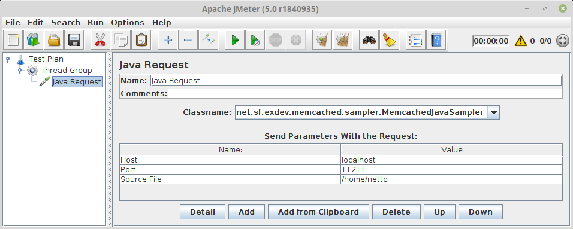

# MemCached Sampler
JMeter sampler for MemCached based on XMemCached

# License
* [BSD License](LICENSE)

# Limitations
* The data mass for JMeter must specified directly at the MemCached sampler (too lazy to RTFM/study JMeter code to implement it properly)
* All limitations from XMemCached driver applies
* Only the following commands are supported at this time: add, set, append, prepend, get, delete, flush

# TODO
* Complete commands
* Complete JMeter integration
* Refactoring as always
* Unit tests

# Setup
1. Compile code with maven:
```bash
netto@morpheus:~$ cd <memcached.sampler directory>
netto@morpheus:~/Dropbox/repo/exdev/java/memcached.sampler$ mvn package install
[INFO] Scanning for projects...
[INFO]
[INFO] ------------------------------------------------------------------------
[INFO] Building memcached.sampler 0.0.1-SNAPSHOT
[INFO] ------------------------------------------------------------------------
[INFO]
[INFO] --- maven-clean-plugin:2.5:clean (default-clean) @ memcached.sampler ---
[INFO] Deleting /home/netto/Dropbox/repo/exdev/java/memcached.sampler/target
[INFO]
[INFO] --- maven-resources-plugin:2.6:resources (default-resources) @ memcached.sampler ---
[INFO] Using 'UTF-8' encoding to copy filtered resources.
[INFO] skip non existing resourceDirectory /home/netto/Dropbox/repo/exdev/java/memcached.sampler/src/main/resources
[INFO]
[INFO] --- maven-compiler-plugin:3.1:compile (default-compile) @ memcached.sampler ---
[INFO] Changes detected - recompiling the module!
[INFO] Compiling 3 source files to /home/netto/Dropbox/repo/exdev/java/memcached.sampler/target/classes
...
[INFO]
[INFO] --- maven-jar-plugin:2.4:jar (default-jar) @ memcached.sampler ---
[INFO]
[INFO] --- maven-install-plugin:2.4:install (default-install) @ memcached.sampler ---
[INFO] Installing /home/netto/Dropbox/repo/exdev/java/memcached.sampler/target/memcached.sampler-0.0.1-SNAPSHOT.jar to /home/netto/.m2/repository/net/sf/exdev/memcached.sampler/0.0.1-SNAPSHOT/memcached.sampler-0.0.1-SNAPSHOT.jar
[INFO] Installing /home/netto/Dropbox/repo/exdev/java/memcached.sampler/pom.xml to /home/netto/.m2/repository/net/sf/exdev/memcached.sampler/0.0.1-SNAPSHOT/memcached.sampler-0.0.1-SNAPSHOT.pom
[INFO] ------------------------------------------------------------------------
[INFO] BUILD SUCCESS
[INFO] ------------------------------------------------------------------------
[INFO] Total time: 1.782 s
[INFO] Finished at: 2018-12-26T01:53:31+01:00
[INFO] Final Memory: 35M/433M
[INFO] ------------------------------------------------------------------------
```

2. Copy jar to JMeter library directory:
```bash
netto@morpheus:~/Dropbox/repo/exdev/java/memcached.sampler$ cp target/memcached.sampler-0.0.1-SNAPSHOT.jar <jmeter.home>/lib/ext
```

# Usage
1. Add a Java Sampler as in the picture below:


2. Fill the parameters (host, port, source file)
   1. Host can be a string (e.g. localhost) or an ip (e.g. 172.243.65.5)
   2. Port can be an integer number between 1 and 65535, default is 11211
   3. Source File is the path of the file containing the data to be submitted, it must follow certain patterns as bellow:


Command | Argument 1 | Argument 2 | Argument 3
------- | ---------- | ---------- | ----------
add | key | value | expiration time
set | key | value | expiration time
append | key | value | -
prepend | key | value | -
get | key | - | -
delete | key | - | -
flush | - | - | -

 All values from columns Command, Argument 1, Argument 2 must be string  
 All values from column Argument 3 must be an integer number

3. Play!!!